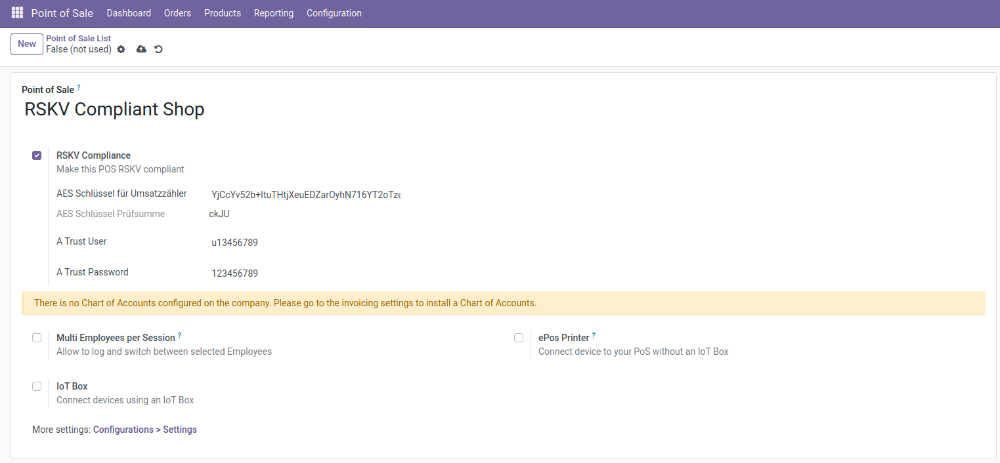
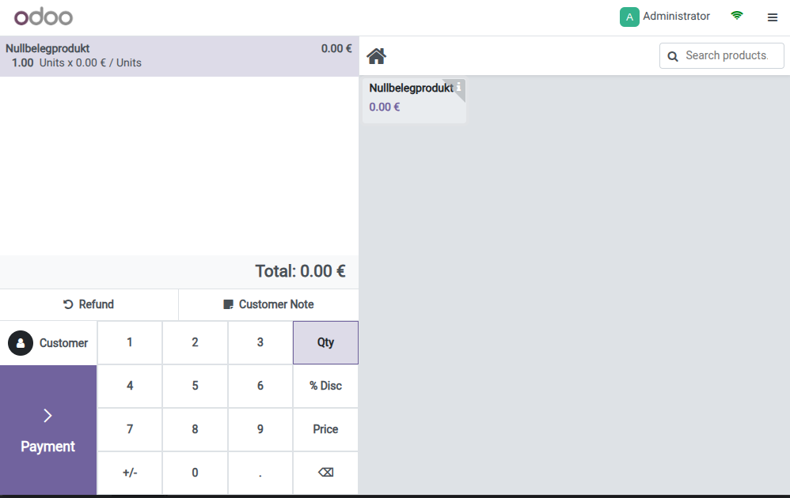
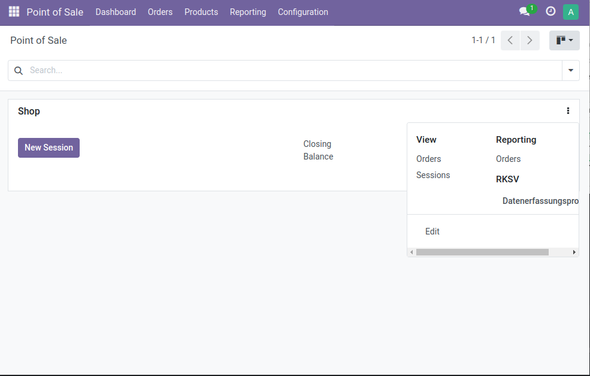

## RSKV-konforme Registrierkasse
Open-Source-Odoo-Addon, das Odoo POS RSKV-konform macht.

## How to use
### Enable RKSV compliance on your POS
To comply with Austrian law, you will need a signature certificate from A-Trust. You can get this certificate from [office@vorstieg.eu](office@vorstieg.eu).
The AES key is automatically generated and needs to be registered with Finanzonline.
When the POS is saved with RKSV enabled, a Startbeleg is automatically created, and can be registered with the "BMF Belegchek" app.

### Nullbeleg
When enabling the RKSV option on any POS, a Nullbelegprokt is automatically created. This product is needed for Startbeleg, as well as for the monthly and yearly end receipt.
When an officer of the financial police checks the POS, it is necessary to create a empty receipt with this product.

### Datenerfassungsprotokoll
According to Austrian law, all receipts need to be exported and backed up once per quarter. To do this, you can export the Datenerfassungsprokoll once for every POS.

