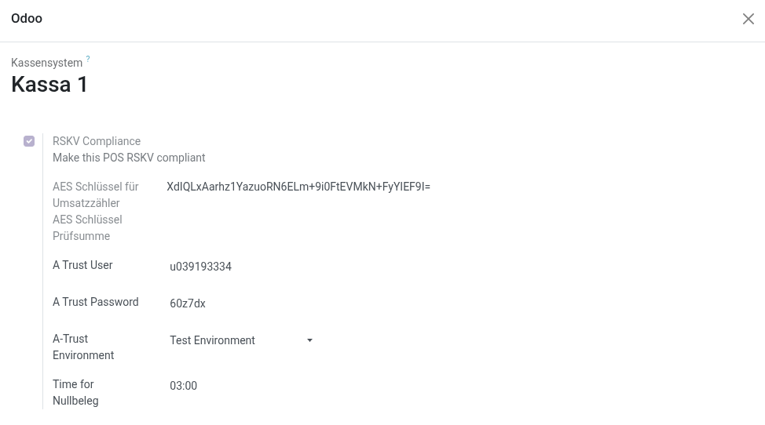
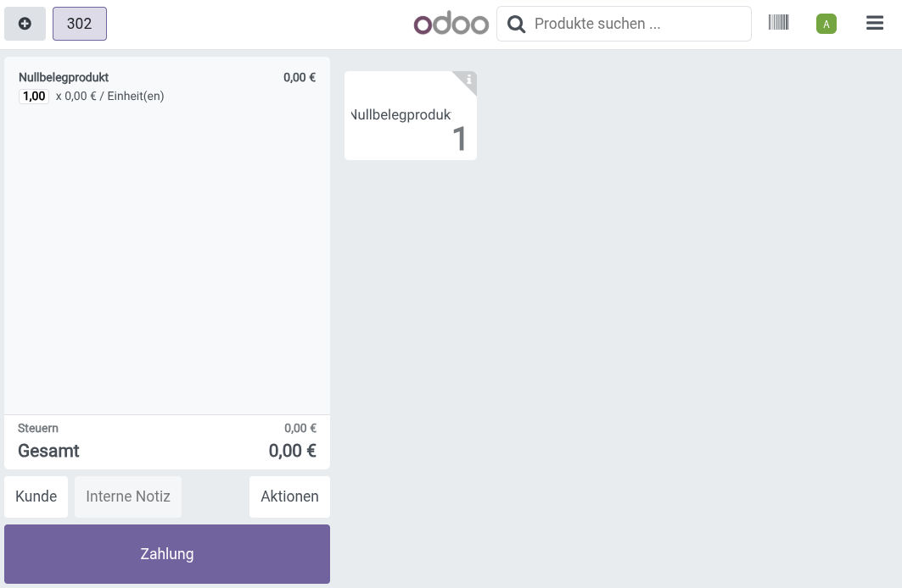
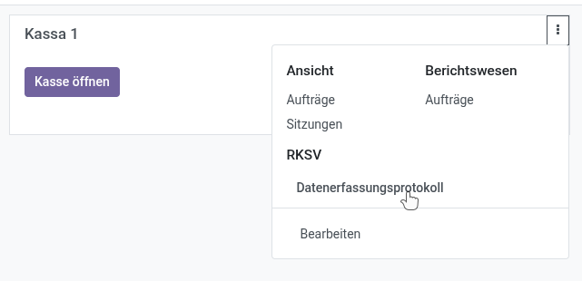

  

# RKSV-compliant Open Source Cash Register

 

Open source Odoo addon, to enable RKSV compliance in Odoo POS.

---

## Features

*   **Full RKSV Compliance:** Seamlessly integrates with Odoo POS to meet all requirements of the Austrian *Registrierkassensicherheitsverordnung* (RKSV), including chain hashing and encrypted revenue counters.
*   **A-Trust HSM Integration:** Built-in support for A-Trust's signing API with support for Test, Production, and QA environments.
*   **Automated FinanzOnline (FON) Integration:**
    *   **Automatic Registration:** Handles registration of cash registers and signature units directly via FON web services.
    *   **Automatic Verification:** Automatically verifies the mandatory Startbeleg and Jahresbeleg.
*   **Automated Compliance Cycles:**
    *   **Monthly Nullbeleg:** Automatically generated via cron job at a configurable time.
    *   **Yearly Jahresbeleg:** Automated generation and verification with FinanzOnline at the end of the year.
*   **Audit-Ready DEP Export:** One-click export of the "Datenerfassungsprotokoll" (DEP) for quarterly backups and tax audits.
*   **Enhanced Receipt Design:** Automatically includes the required QR code and RKSV-specific metadata on POS receipts.
*   **Reliability & Security:** Manual retry mechanisms for signing resilience and immutable audit trails (prevents deletion of signed orders).

---

## Table of Contents

- [How to Use](#how-to-use)
  - [Prerequisites](#prerequisites)
  - [Enable RKSV Compliance on your POS](#enable-rksv-compliance-on-your-pos)
  - [RKSV Configuration Options](#rksv-configuration-options)
  - [FinanzOnline Configuration](#finanzonline-configuration)
- [Compliance Procedures](#compliance-procedures)
  - [Nullbeleg (Monthly/Yearly)](#nullbeleg-monthlyyearly)
  - [Datenerfassungsprotokoll (DEP)](#datenerfassungsprotokoll-dep)
- [Support](#support)

---

## How to Use

### Prerequisites

To comply with Austrian law, a signature certificate from A-Trust is required. This certificate can be obtained via [office@vorstieg.eu](mailto:office@vorstieg.eu).

### Enable RKSV Compliance on your POS

1.  Navigate to **Point of Sale > Configuration > Settings**.
2.  Enable the **Austrian RKSV** option.
3.  Enter your A-Trust credentials and select the appropriate environment (Test/Production/QA).
4.  Upon saving, the module will automatically:
    *   Generate a unique AES key for your revenue counter.
    *   Initialize the receipt sequence.
    *   Create and sign the **Startbeleg**.
    *   (Optional) Register everything with FinanzOnline if configured.

### RKSV Configuration Options

*   **A-Trust User Name/Password:** Your credentials for the A-Trust RK-Online API.
*   **Umsatzzähler AES:** An automatically generated 256-bit key for revenue encryption.
*   **A-Trust Environment:** Choose between *Test*, *Production*, or *QA (Abnahme)*.
*   **Time for Nullbeleg:** Set the preferred execution time for the monthly automated zero-receipt.

### FinanzOnline Configuration

To enable automated registration and verification, configure the FinanzOnline (FON) parameters in the Settings:
*   `pos_registrierkasse.fon_tid`: Participant ID (Teilnehmer-Identifikation).
*   `pos_registrierkasse.fon_benid`: User ID (Benutzer-Identifikation).
*   `pos_registrierkasse.fon_pin`: User PIN.

If you want your new POS to be automatically registered in FON, you need to configure this BEFORE creating the POS.

---

## Compliance Procedures

### Nullbeleg (Monthly/Yearly)

A "Nullbeleg" (zero-value receipt) is required at the end of every month and year. This module automates this process using an Odoo Cron Job.

*   **Monthly:** Automatically created on the last day of each month.
*   **Yearly (Jahresbeleg):** Created on December 31st and automatically transmitted to FinanzOnline for verification.

Manual creation is also possible using the "Nullbelegprodukt" created by the module.

### Datenerfassungsprotokoll (DEP)

Austrian law requires a quarterly backup of all signed receipts.
1.  Go to the POS Dashboard.
2.  Click the three dots (menu) on your POS card.
3.  Select **Download DEP**.

---

## Support

For technical support, integration assistance, or to obtain A-Trust certificates, please contact:
**Vorstieg Software FlexCo**
Website: [https://registrierkasse.vorstieg.eu](https://registrierkasse.vorstieg.eu)
Email: [office@vorstieg.eu](mailto:office@vorstieg.eu)
